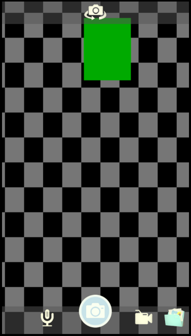

# CamMuse - Audio-Photo-Video application

This project is a faculty project. The CamMuse is an android application that has next main functionalities:
- take photo
- record video
- record audio

## Project setup
1. Clone or download project
2. Sync Project with Gradle Files
3. Run application

## Design and Development

### Design 
For design was created images for all applications buttons using Photoshop.

Main buttons:
- switchCamera (switch camera from front to back)
- micButton (change application mode to audio recording)
- videoButton (change application mode to video recording)
- imageButton  (change application mode to photo)
- actionButton (do photo,video, or audio, depend on application mode)
- folderButton (open folder with saved images,video,audio)

### Development
For development was using
- Android Studio
- SDK: Android Lollipop (API Level 24)
- Gradle 3.4.1
- Tested on Pixel 2 emulation